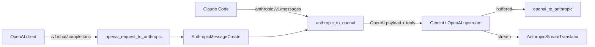

# Tool-Calling Round-Trip Support

## Problem

Claude Code sends `tools` + `tool_use`/`tool_result` content, but the proxy strips them at every stage, so Gemini gets no function declarations and emits its trained `tool_code='...'` text instead of real calls. We must thread tools through both proxy paths, streaming and non-streaming.

## Data flow (both endpoints converge on the internal Anthropic model)

## Design decisions

- Internal representation stays `AnthropicMessageCreate`. Tools/tool_choice and `tool_use`/`tool_result` content blocks become first-class there.
- Conditionally include OpenAI `tools`/`tool_choice` only when present, so existing exact-payload tests (e.g. `test_messages_route_translates_anthropic_request_to_openai_upstream`) still pass.
- Messages containing only text blocks keep flattening to a plain `content` string (preserves current behavior/tests).
- tool_result content supports `str | list[text blocks]`, flattened to a string for the OpenAI `tool` message.
- Test-first: add translator unit tests + route tests before wiring.

## Phase 1 - Anthropic schemas ([backend/app/schemas/anthropic.py](backend/app/schemas/anthropic.py))

- Add request content blocks and a discriminated union on `type`:
  - `AnthropicToolUseBlock` = `{type:"tool_use", id, name, input: dict}`
  - `AnthropicToolResultBlock` = `{type:"tool_result", tool_use_id, content: str|list[text], is_error?: bool}`
  - `AnthropicMessage.content: str | list[AnthropicContentBlock]` where block union = text | tool_use | tool_result.
- Add request fields to `AnthropicMessageCreate`:
  - `tools: list[AnthropicToolDefinition] | None` where def = `{name, description?, input_schema: dict}`
  - `tool_choice: dict | None` (Anthropic shape: `{type:"auto"|"any"|"tool", name?}`)
- Add response tool_use block and widen response content:
  - `AnthropicResponseToolUseBlock` = `{type:"tool_use", id, name, input: dict}`
  - `AnthropicMessageResponse.content: list[text | tool_use]`

## Phase 2 - Request translation Anthropic -> OpenAI ([backend/app/translators/anthropic_to_openai.py](backend/app/translators/anthropic_to_openai.py))

- Rework message building to walk content blocks:
  - text-only message -> `{"role", "content": str}` (unchanged).
  - assistant `tool_use` blocks -> assistant msg with `tool_calls:[{id, type:"function", function:{name, arguments: json.dumps(input)}}]` (plus text content if present).
  - user `tool_result` blocks -> one `{"role":"tool", "tool_call_id": tool_use_id, "content": <flattened>}` per result.
- Translate `tools` -> `[{type:"function", function:{name, description, parameters: input_schema}}]` (only if non-empty).
- Translate `tool_choice`: `auto`->"auto", `any`->"required", `{type:"tool",name}`->`{type:"function",function:{name}}`; omit if absent.

## Phase 3 - Buffered response OpenAI -> Anthropic ([backend/app/translators/openai_to_anthropic.py](backend/app/translators/openai_to_anthropic.py))

- In `translate_openai_chat_completion_to_anthropic`, read `message.tool_calls`; build `tool_use` blocks `{id, name, input: json.loads(arguments or "{}")}`.
- content = optional leading text block + tool_use blocks (skip empty text block when only tool calls).
- `stop_reason` already maps `tool_calls -> tool_use` via `STOP_REASON_MAP`.

## Phase 4 - Streaming response ([backend/app/translators/openai_to_anthropic.py](backend/app/translators/openai_to_anthropic.py) `AnthropicStreamTranslator`)

State machine to support multiple content blocks (text at index 0, tool_use at later indices):
- Track `next_index`, currently-open block, and a map from OpenAI `delta.tool_calls[].index` -> Anthropic content-block index.
- Text delta: ensure text block open at index 0, emit `content_block_delta` `text_delta` (current behavior).
- Tool-call delta: on first sight of an OpenAI tool index, close any open block (`content_block_stop`), emit `content_block_start` with `{type:"tool_use", id, name, input:{}}`; for argument fragments emit `content_block_delta` `{type:"input_json_delta", partial_json}`.
- `finish_events`: close the open block, emit `message_delta` with mapped `stop_reason`, then `message_stop`.
- Keep accumulating `text_parts` for usage estimation.

## Phase 5 - OpenAI-in request path ([backend/app/schemas/openai.py](backend/app/schemas/openai.py), [backend/app/translators/openai_request_to_anthropic.py](backend/app/translators/openai_request_to_anthropic.py))

- `OpenAIChatCompletionCreate`: add `tools`, `tool_choice`. `OpenAIChatMessage`: allow `role:"tool"`, `tool_calls`, `tool_call_id`, `name`, and nullable content.
- `translate_openai_chat_completion_request_to_anthropic`: carry `tools`/`tool_choice` into `AnthropicMessageCreate`; convert OpenAI `assistant.tool_calls` -> Anthropic `tool_use` blocks and `role:"tool"` msgs -> `tool_result` blocks (mapping OpenAI tool defs `{type:"function",function:{...}}` -> Anthropic tool defs).
- Note: `/v1/chat/completions` returns the raw upstream OpenAI body and passes stream chunks through verbatim, so response-side tool_calls already work for OpenAI-in; only the request side needs changes.

## Phase 6 - Tests

- New `backend/tests/test_tool_translation.py`: unit tests for tools request translation, tool_use/tool_result history, buffered tool_use response, and streaming tool_use event sequence.
- Extend [backend/tests/test_proxy_routes.py](backend/tests/test_proxy_routes.py): `/v1/messages` with tools asserts OpenAI payload includes `tools`/`tool_choice`; upstream `tool_calls` response returns Anthropic `tool_use` block with `stop_reason:"tool_use"`; a streaming case asserting `content_block_start(tool_use)` + `input_json_delta`.
- Run `pytest` in `backend/` and fix regressions.

## Verification

- `cd backend && pytest`
- Manual: point Claude Code at the proxy with a Gemini model, ask it to create a file, confirm a real Write tool call fires (no `tool_code` text).
